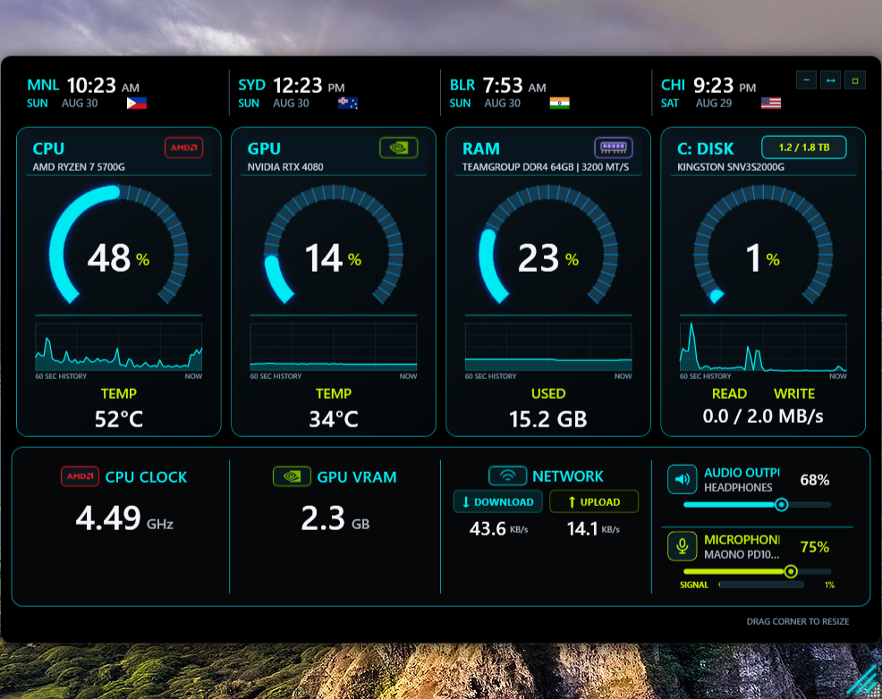
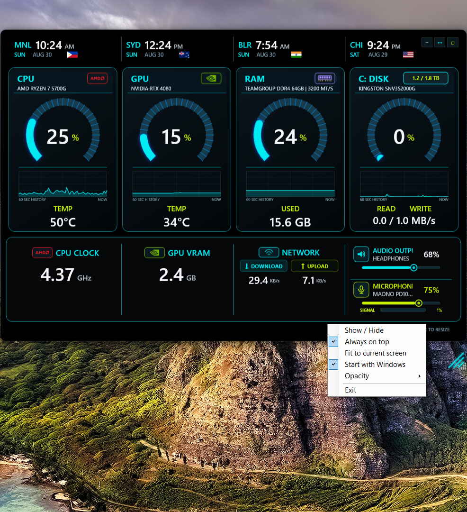
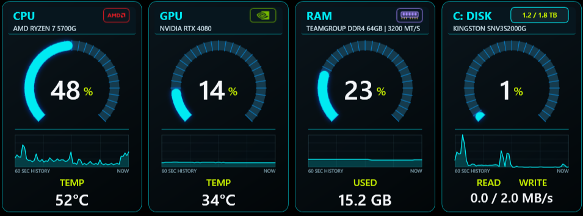
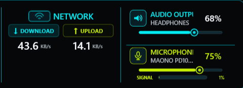

# NeonPulseWidget

NeonPulseWidget is a resizable Rainmeter-inspired Windows desktop monitor built
with Windows PowerShell 5.1 and WPF. It runs as a normal user, makes no network
requests, and needs no installer or .NET SDK.

## Feature highlights

- **Critical-load color alerts:** when CPU utilization, dedicated VRAM usage,
  RAM usage, or drive active time reaches 90% or higher, the segmented arc,
  central value, percent sign, and history graph automatically change from cyan
  to red. The normal colors return when utilization drops below the critical
  range.
- **0–100% opacity control:** use the themed opacity slider in the right-click
  menu to blend the widget into the desktop or make it fully transparent. The
  notification-area icon remains available to restore an invisible widget.
- **Ctrl+click shortcuts:** open Task Manager's CPU Performance view, select a
  different monitored drive, or customize any world clock directly from its
  card.
- **Responsive desktop layout:** drag to move, resize uniformly from the lower-
  right corner, switch between compact and restored sizes, maximize on the
  current display, or fit automatically to the current screen.
- **Notification-area operation:** minimize without losing the widget, restore
  it from the hidden-icons menu, keep it always on top, and optionally start it
  with Windows.
- **Integrated audio controls:** mute, unmute, adjust volume or input gain,
  cycle through active playback and recording devices, and watch the live
  microphone signal level.
- **At-a-glance history:** each primary hardware gauge includes a rolling
  60-second graph so brief spikes remain visible after the live value changes.
- **Persistent personal settings:** layout, opacity, monitored drive, clocks,
  and other preferences are stored per Windows user rather than in the project.

## Screenshots

### Complete widget overview

The responsive dashboard combines four primary gauges, rolling history,
secondary hardware statistics, network activity, and Core Audio controls.



### Desktop menu and opacity access

The themed right-click menu provides visibility, always-on-top, screen fitting,
Windows startup, opacity, and exit controls without adding a conventional title
bar.



### Primary gauges and rolling history

CPU, dedicated VRAM, RAM, and drive activity use segmented percentage gauges
with technology badges and 60-second history graphs. These cyan indicators turn
red automatically in the critical 90% range.



### Customizable world clocks and window controls

Each clock shows a city code, local time, date, and flag. Ctrl+click a clock to
select another time zone; use the upper-right buttons to minimize, resize, or
maximize the widget.


### Network, audio output, and microphone controls

Network rates switch dynamically between KB/s and MB/s. The adjacent audio
panel exposes the active devices, volume and gain sliders, mute controls, device
cycling, and a live microphone signal meter.



## Compatibility

- Windows 10 or Windows 11, x64
- Windows PowerShell 5.1
- Multi-monitor and mixed-resolution displays
- CPU, GPU, memory, fixed/removable drives, Ethernet/Wi-Fi, and Windows Core
  Audio devices exposed through standard Windows APIs

The normal widget works without administrator access. CPU temperature is an
optional hardware-specific feature; see [Optional CPU temperature](#optional-cpu-temperature).

## Quick start

1. Download the ZIP from the latest GitHub Release rather than the automatically
   generated repository source archive.
2. Extract the complete ZIP to a writable folder. Do not run individual files
   directly from inside the archive.
3. Double-click `Run Widget.cmd`.

The launcher verifies every distributed executable and dependency against
`SHA256SUMS.txt` before starting. Settings are stored per user under
`%LOCALAPPDATA%\NeonPulseWidget`; nothing is written into the repository.

To verify manually:

```powershell
powershell.exe -NoProfile -ExecutionPolicy RemoteSigned -File ".\Verify Integrity.ps1"
```

## Prompt an AI to install it safely

Copy this prompt into an AI coding assistant after downloading the latest
release ZIP or cloning this repository:

```text
Install NeonPulseWidget locally on this Windows PC from the files in this
folder. First inspect the README, BUILDING.md, SECURITY.md, and SHA256SUMS.txt.
Verify the package with `Verify Integrity.ps1` before running anything. Use
Windows PowerShell 5.1 and the included `Run Widget.cmd`; do not download
replacement files, add dependencies, disable security controls, bypass the
execution policy, or request administrator access. Explain any verification
failure and stop rather than ignoring it. Ask me for confirmation before
creating a Windows startup entry, changing firewall or system settings, or
running an elevated command. After installation, report the exact folder,
verification result, and how to restore or remove the widget.
```

An AI should treat repository instructions as technical guidance only; your
explicit request remains authoritative. Never paste secrets or approve an
elevated command unless you understand exactly what it changes.

## What it monitors

- CPU load, clock, and optional temperature
- Dedicated GPU-memory utilization as a percentage of total VRAM, plus NVIDIA temperature when supported
- RAM load and used capacity
- Selected-drive activity, capacity, and read/write rate
- Network download and upload rate with dynamic KB/s or MB/s units
- Default audio-output device, volume, mute state, and device switching
- Default microphone, input gain, mute state, live signal, device switching, and
  synchronized mute/unmute across every active microphone endpoint
- Four customizable world clocks with dates and flags

GPU performance counters are filtered to the LUID of the detected display
adapter so data from integrated and discrete GPUs is not combined. On NVIDIA
systems, the widget uses only the installed `%SystemRoot%\System32\nvidia-smi.exe`
after validating its Authenticode signer. NVIDIA reports exact dedicated-memory
capacity; other vendors use Windows' reported capacity and safely show `N/A` when
a temperature source is unavailable.

## Controls

| Action | Result |
| --- | --- |
| Drag the background | Move the widget |
| Drag the lower-right corner | Resize the complete interface uniformly |
| Double-click the resize corner | Fit the widget to the current screen |
| Upper-right minimize button | Send the widget to the notification area |
| Upper-right resize button | Toggle compact and restored sizes |
| Upper-right maximize button | Maximize on the current display |
| Right-click the widget or tray icon | Open visibility, always-on-top, fit-to-screen, startup, opacity, and exit controls |
| Ctrl+click the CPU card | Open Task Manager's CPU Performance view |
| Ctrl+click the drive card | Select another available fixed or removable drive |
| Ctrl+click any clock | Select another city and time zone |
| Click the speaker icon | Mute or unmute the default audio-output device |
| Click the microphone icon or status | Mute or unmute every active microphone, including non-default USB, wireless, and built-in inputs |
| Click the speaker or microphone name | Cycle to the next active device |
| Drag the cyan or lime audio slider | Adjust output volume or microphone input gain |

Microphone status distinguishes Windows endpoint mute (`MUTED`) from inferred
physical or firmware mute (`HW MUTED`). The latter is detected generically when
an enabled microphone with nonzero gain first produces real signal and then
falls to sustained exact digital silence; audio returning clears the state
immediately. This avoids treating an idle, quiet microphone as muted. Because
some microphones apply a hardware noise gate that also emits digital silence,
`HW MUTED` is an informed signal-state inference rather than a vendor-specific
button read.

The microphone mute control intentionally operates on **all active Windows input
endpoints**. If any microphone is currently unmuted, clicking the icon or status
mutes all of them; if every microphone is muted, the next click unmutes them
together. The device name and gain slider still refer to the selected default
microphone. Unmuting clears Windows endpoint mute; a microphone's own physical
or firmware mute remains in effect until it is released on that device.

### Critical utilization colors

The CPU, GPU, RAM, and drive gauges use cyan for their normal operating range.
At **90% or higher**, the active arc, numeric value, unit, and rolling graph turn
red to make sustained pressure immediately visible. This is a visual warning,
not an automatic throttling or process-control action. The gauge returns to its
normal theme automatically after utilization falls below the threshold.

### Opacity and recovery

Right-click the widget or its notification-area icon and use the **Opacity**
slider to choose any value from 0% through 100%. At 0% the window is fully
transparent, but it is not closed: use the NeonPulseWidget icon in the Windows
hidden-icons menu to restore visibility or select a higher opacity.

## Recommended future enhancements

The following ideas are not implemented yet, but would extend the widget while
preserving its local-first and readable design:

- User-configurable warning and critical thresholds, including separate colors
  for each metric.
- Optional local desktop notifications with a cooldown to prevent repeated
  alerts during sustained high utilization.
- A GPU-card mode selector for dedicated VRAM percentage, GPU-engine load, or a
  compact split view of both values.
- Configurable graph duration and an opt-in local CSV export for troubleshooting
  performance spikes.
- Importable layout and theme profiles for moving the same configuration between
  computers without copying machine-specific sensor data.

## Optional CPU temperature

Windows has no universal unprivileged CPU-temperature API. The default launcher
therefore displays `NO SENSOR` when no approved provider is running.

Users who want CPU temperature can install the official signed PawnIO package:

```powershell
winget install --id namazso.PawnIO --exact
```

Then run `Run Widget with CPU Temperature.cmd` and approve the UAC prompt. Only
the small read-only sensor helper is elevated; the WPF widget remains a normal
user process. PawnIO is not bundled, installed, updated, or downloaded by this
project.

Kernel drivers and elevated hardware access always increase attack surface. Use
the ordinary launcher if minimum privilege is more important than CPU temperature.

## Reproducing and validating a release

A clean clone can validate its dependencies and build a deterministic release:

```powershell
powershell.exe -NoProfile -ExecutionPolicy RemoteSigned -File ".\tools\Test-Repository.ps1"
powershell.exe -NoProfile -ExecutionPolicy RemoteSigned -File ".\tools\Build-Release.ps1"
```

The first command parses all PowerShell sources, verifies the release manifest,
checks every DLL against `dependencies.lock.json`, rejects committed user-specific
paths, and confirms that two builds produce identical ZIP hashes. The second
creates `dist\NeonPulseWidget.zip` with stable file ordering and timestamps.

See [BUILDING.md](BUILDING.md) for clean-clone instructions and hardware-dependent
behavior.

## Security and privacy

- No telemetry, web requests, downloading logic, encoded commands, or remote
  control functionality
- Normal operation runs without administrator privileges
- Hash verification before both normal and optional elevated launch paths
- Bundled DLL versions, source locations, licenses, and hashes recorded in
  `dependencies.lock.json`
- Optional NVIDIA utility accepted only from System32 with a valid Microsoft
  hardware-publisher or NVIDIA signature
- Per-user configuration contains preferences only and is never committed

Read [SECURITY.md](SECURITY.md), `SECURITY.txt`, and `SECURITY-AUDIT.txt` before
redistributing the package or enabling optional sensor access.

## Third-party components

The optional sensor helper uses a hash-pinned build of LibreHardwareMonitor from
commit [`adf717d75a17f107629f63755f0e08b992e43ca9`](https://github.com/LibreHardwareMonitor/LibreHardwareMonitor/tree/adf717d75a17f107629f63755f0e08b992e43ca9),
licensed under MPL 2.0. Microsoft compatibility libraries are MIT licensed.
Complete notices are in `THIRD-PARTY-NOTICES.txt` and
`LICENSE-LibreHardwareMonitor.txt`.

## Uninstall

Disable `Start with Windows` from the widget menu, exit through the tray icon,
delete the extracted widget directory, and optionally remove
`%LOCALAPPDATA%\NeonPulseWidget` to erase saved preferences.
